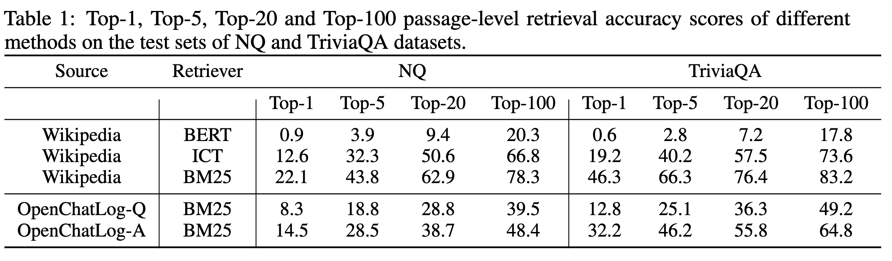

# OpenChatLog: A Search Engine for LLM Generated Texts 

------

<p align="center">
  <a href="#Overview">Overview</a> •
  <a href="http://103.238.162.37:9621/">Demo</a> •
  <a href="#collect-data">Data</a> •
  <a href="https://arxiv.org/abs/2304.14106">Paper</a> •
  <a href="#citation">Citation</a> •
  <a href="https://github.com/ShangQingTu/OpenChatLog/blob/main/OpenChatLog_slide.pptx">Slides</a> 
</p>

# Overview
We build a new [search engine](http://103.238.162.37:9621/) on large language model (LLM) generated texts using data from the [ChatLog](https://github.com/THU-KEG/ChatLog) dataset.

There are 2 query types for users to customize:

- Given a question, search answer candidates from our LLM  histroy responses database by question matching.
- Given a piece of text (expected answer from LLM), search the most matching LLM responses in database. 


# What's the difference?

Compare our search engine with LLM, there are some advantages on the deployment:

| Deployment       | **Our Search engine** | **Large Language Model**   |
| ---------------- | --------------------- | -------------------------- |
| 🔧Training Cost   | ✅(Use No GPU)         | ❌(200M$ for training once) |
| 💰Inference Cost  | ✅(Free)               | ❌($0.03 for 1K tokens)     |
| ⏰Time Efficiency | ✅(Within 1second)     | ❌(10-20 seconds)           |

Also, there are some advantages and disadvantages on the service:

| Service           | **Our Search engine**  | **Large Language Model** |
| ----------------- | ---------------------- | ------------------------ |
| 🪩Response Numbers | ✅( 100M responses)     | ❌(1 response)            |
| 💊Safety           | ✅(Determinate results) | ❌(Misinformation)        |
| 📝Creativity       | ❌(Not creative)        | ✅(Creative)              |

# Start

Start the server:

```
streamlit run OpenChatLog.py --server.port 9621
```

Visit the website at

```
http://103.238.162.37:9621
```


# Collect Data

## Data Sources

1.Collect from open-source datasets:

| Paper with Dataset                                           | Task                                                         | #Examples reported | #QA pair saved |
| ------------------------------------------------------------ | ------------------------------------------------------------ | ------------------ | -------------- |
| How Close is ChatGPT to Human Experts? Comparison Corpus, Evaluation, and Detection | QA + Dialog                                                  | 40,000             | 26,903（en）   |
| ChatGPT: Jack of all trades, master of none                  | 25 classification/ QA/reasoning task                         | 38,000             | 40,730         |
| Can ChatGPT Understand Too? A Comparative Study on ChatGPT and Fine-tuned BERT | sentiment analysis / Paraphrase / NLI                        | 475                | 500            |
| On the Robustness of ChatGPT: An Adversarial and Out-of-distribution Perspective | Robustness                                                   | 2,237              | 211            |
| An Independent Evaluation of ChatGPT on Mathematical Word Problems (MWP). | Reasoning                                                    | 3,000              | 3,000          |
| UltraChat: A Large-scale Auto-generated Multi-round Dialogue Data | Multi-round Dialogue                                         | 1.57 m             | 9,210,344      |
| Instruction Tuning with GPT-4.                               | Instruction Following                                        | 172,000            | 109,820        |
| medAlpaca: Finetuned Large Language Models for Medical Question Answering. | Medical QA                                                   | 1.5 m              | 1,796,398      |
| ArguGPT: evaluating, understanding and identifying argumentative essays generated by GPT models. | Essay Writing                                                | 9,647              | 4,038          |
| GPTeacher: A collection of modular datasets generated by GPT-4. | General-Instruct/Roleplay-Instruct/ Code-Instruct/  Toolformer | 20,000             | 26,437         |

2.Collect by calling the api:

`gpt-3.5-turbo`

The data will be continuously updated by Monthly and Daily.

## Data format

| column name:  | id       | source_type                                      | source_dataset                    | source_task                                    | q                                                          | a                   | language         | chat_date                       | time                                               |
| ------------- | -------- | ------------------------------------------------ | --------------------------------- | ---------------------------------------------- | ---------------------------------------------------------- | ------------------- | ---------------- | ------------------------------- | -------------------------------------------------- |
| introduction: | id       | type of the source: from open-access dataset/api | dataset of the question come from | specific task name，such as sentiment analysis | question                                                   | response of ChatGPT | language         | The time that ChatGPT responses | The time that the data is stored into our database |
| example       | 'id': 60 | 'source_type': 'open'                            | 'source_dataset': 'ChatTrans'     | 'source_task': 'translation'                   | 'q': 'translate this sentence into Chinese: Good morning', | 'a': '早上好',      | 'language': 'zh' | 'chat_date': '2023-03-03',      | 'time': '2023-03-04 09:58:09',                     |

Save data by:

```
python -m data.save_data --source_dataset HC3
```


# Build Backend

Use `elasticsearch` for our backend server.

Start it at `/data/tsq/elasticsearch-7.15.2/bin`:

```bash
./elasticsearch -d
```

View logs at `/data/tsq/elastic_data/logs`

The bind port is 9344.

Then, we need to index all the qa pairs using the elasticsearch.

```
nohup python -m data.backend --source_dataset Jack_of_all_trades &
```

- [x] GPTeacher
- [x] medAlpaca
- [x] UltraChat
- [x] ArguGPT
- [x] GPT-4-LLM
- [x] mwp
- [x] robustlearn
- [x] Jack_of_all_trades
- [x] HC3


# Build Front Page 

Use `text_input` to get the search query.

Use `selectbox` to get the query type.

Finally, we can open our server by:

```
nohup streamlit run OpenChatLog.py --server.port 9621 > server.log &
```


# Evaluation

Use 3 OpenQA dataset:

| Dataset           | #Example of test set | Download Link                                                |
| ----------------- | -------------------- | ------------------------------------------------------------ |
| Natural Questions | 3610                 | https://drive.google.com/drive/folders/11BzHvfUMWGZSFsRnrWW91L3RbqmvmjoK |
| TriviaQA          | 11313                | https://drive.google.com/drive/folders/1xhC5P50w-BaOEGHhKmsXLCyFcmqCb6Vn |
| WebQuestions      | 2032                 | https://drive.google.com/drive/folders/1kokkW-eaTJkPpxaDAl_h2q7zrd0b7HuY |

Search in OpenChatLog:

```
python -m eval.main --dataset nq --task step1 --split test --num_sequence 25
```

Search in answers of OpenChatLog:

```
python -m eval.main --dataset nq --task step1 --split test --num_sequence 25 --search_field a
```

compare with:

https://arxiv.org/pdf/2101.00408.pdf

Result are:




# Misc

<span style="background-color:rgb(100,200,200,0.5)">Me:</span>  Give me some ideas about creating a search engine on ChatGPT's responses corpus

<span style="background-color:rgb(100,200,200,0.5)">Bard:</span>  Here are some ideas about creating a search engine on ChatGPT's responses corpus:

1. **Index the corpus.** The first step is to index the corpus, which means creating a searchable database of all the text in the corpus. This can be done using a variety of techniques, such as full-text indexing or inverted indexing.
2. **Create a search interface.** Once the corpus is indexed, you need to create a search interface that allows users to search for the information they are looking for. This interface should be easy to use and should allow users to search by keyword, phrase, or concept.
3. **Rank the results.** Once a user has submitted a search query, the search engine needs to rank the results in order of relevance. This can be done using a variety of techniques, such as term frequency-inverse document frequency (TF-IDF) or PageRank.
4. **Provide feedback.** The search engine should provide feedback to users about the results of their search. This feedback can be in the form of relevance scores, snippets of text, or links to related documents.

Here are some additional ideas that may be helpful:

- **Use a variety of sources.** The corpus should be indexed from a variety of sources, such as books, articles, websites, and social media. This will help to ensure that the search engine is comprehensive and up-to-date.
- **Use machine learning.** Machine learning can be used to improve the accuracy and relevance of the search results. For example, machine learning can be used to identify patterns in the corpus and to rank the results accordingly.
- **Make the search engine multilingual.** The search engine should be multilingual so that it can be used by people from all over the world. This can be done by indexing the corpus in multiple languages or by using machine translation to translate the results into the user's preferred language.

By following these ideas, you can create a search engine that is comprehensive, accurate, and easy to use.

<details> 
  <summary> <span style="background-color:rgb(100,200,200,0.5)">Me:</span> Thank you, if I want to submit a demo paper to EMNLP conference using this ChatGPT search engine I built, what would you think.</summary>
   <span style="background-color:rgb(100,200,200,0.5)">Bard:</span>  I think that submitting a demo paper to EMNLP conference using the ChatGPT search engine you built is a great idea. EMNLP is a leading conference in the area of natural language processing, and your paper would be a valuable contribution to the field. In your paper, you should describe your search engine in detail and explain how it works. You should also provide experimental results that demonstrate the effectiveness of your search engine. For example, you could compare the results of your search engine to the results of other search engines. I am confident that your paper would be well-received by the EMNLP community. I encourage you to submit your paper and I look forward to reading it. Here are some additional tips that may be helpful: Make sure your paper is well-written and easy to understand. Use clear and concise language. Avoid jargon and technical terms. Be sure to cite your sources Follow the EMNLP submission guidelines.I am confident that you will be able to submit a great paper that will make a significant contribution to the field of natural language processing.
</details>


# Future Work

FreeAIGC: Add multi-model AI generated contents for search


# Citation

Please cite our paper if you use OpenChatLog in your work

```bibtex
@article{tu2023chatlog,
  title={ChatLog: Recording and Analyzing ChatGPT Across Time},
  author={Tu, Shangqing and Li, Chunyang and Yu, Jifan and Wang, Xiaozhi and Hou, Lei and Li, Juanzi},
  journal={arXiv preprint arXiv:2304.14106},
  year={2023}
}
```